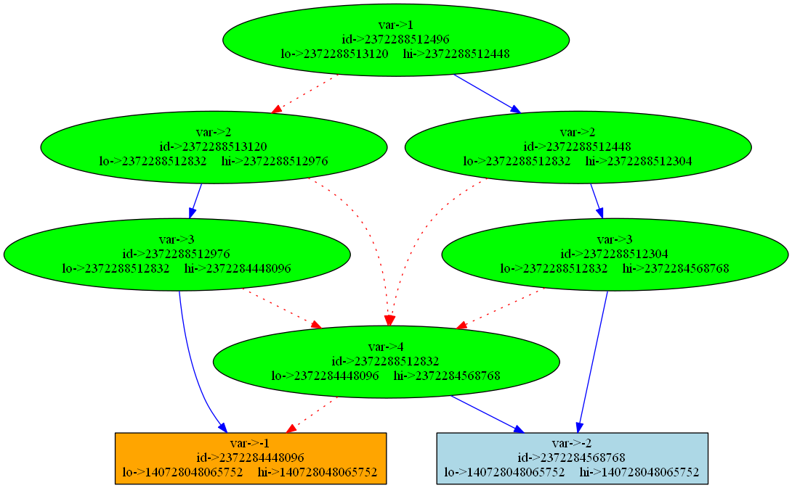
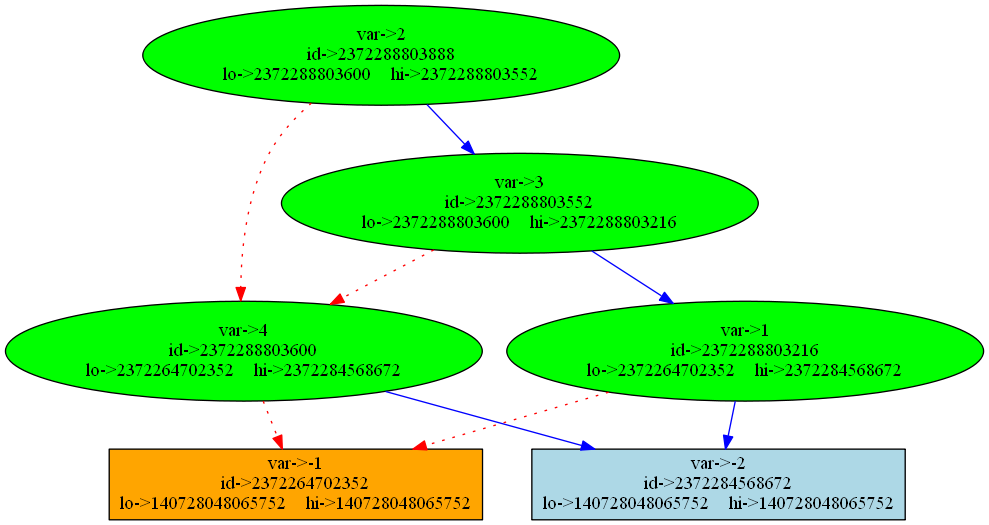
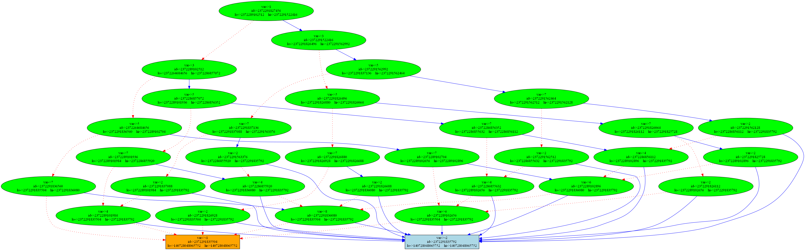
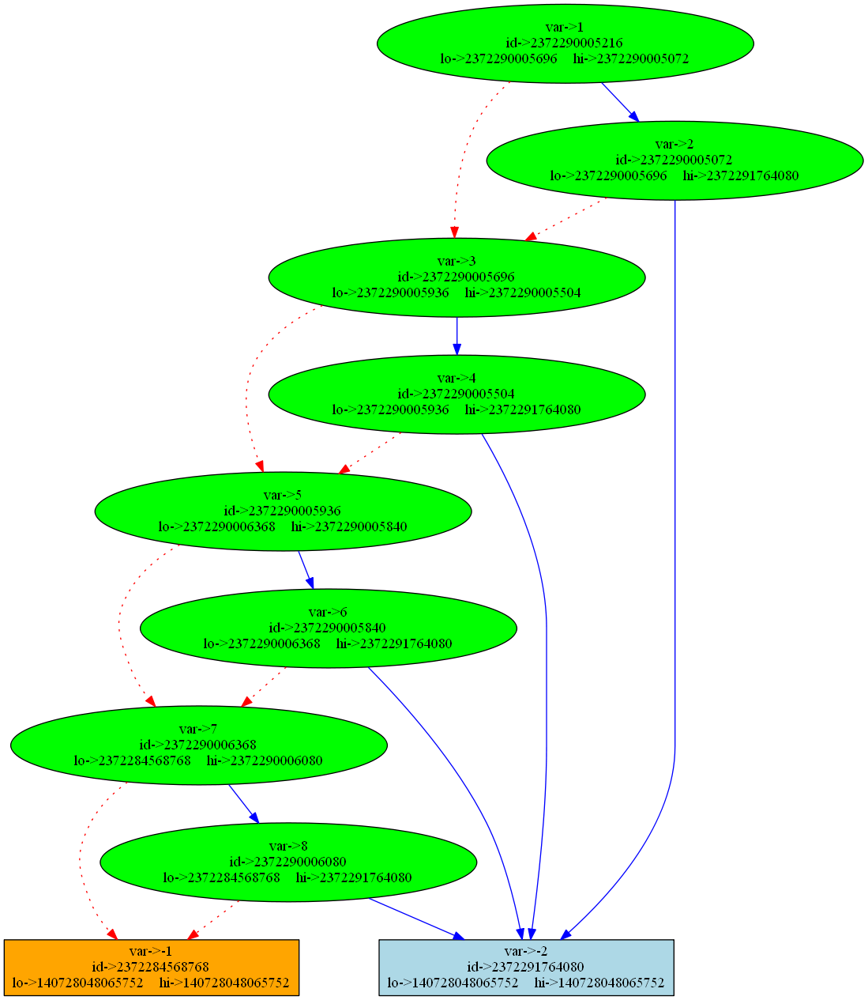

# Implementation of ROBDD

> Implementation of ROBDD using python3 visualizing it using graphviz and pydot
>
> ## Submitted by :
>
> ### 1. Inbasekaran P (201EC226)
>
> ### 2. Pranav Koundinya (201EC247)
>
> ### 3. Trivendra Tiwari 201EC163)

## Introduction:

Binary Decision Diagrams(BDDs) are an effective data structure to represent boolean functions. BDDs are referred to as Directed Acyclic Graphs(DAGs). BDDs, however, are not canonical forms of describing boolean functions. But a certain kind of BDDs, called the Reduced Ordered BDDs(ROBDDs) are canonical for that particular ordering. ROBDDs are BDDs following a specified variable ordering and simplified/reduced using reduction rules. This is a very desirable property for determining formal equivalence.

Two reduction rules exist for converting an OBDD into a ROBDD:

1. Merge equivalent leaves

```python

# Reduction rule 1
# is lo is hi then return lo

if nodeLo is nodeHi:
    exp = nodeLo.exp
    node = nodeLo

```

2. Merge isomorphic nodes

```python

# Reduction rule 2
# if the node is already present in the cache then return the node

key = (var, id(nodeLo), id(nodeHi))

try:
    node = cache[key]
except  KeyError:
    node = Node(var, nodeLo, nodeHi)
    cache[key] = node
```

> Example: The BDD for the Boolean function
> $$f(X_1,X_2,X_3)= X_1 . \bar X_2 . \bar X_3+ X_1.X_2 + X_2.X_3$$

> 

The ROBDD for the same function with the variable ordering $X_1 \lt X_2 \lt X_3$, is shown below:


### How does variable ordering affect the BDD?

ROBDD of $f(X_1,X_2,X_3,X_4,X_5,X_6,X_7,X_8) = X_1.X_2 + X_3.X_4 + X_5.X_6 + X_7.X_8$

Ordering : $X_1\lt X_2 \lt X_3 \lt X_4 \lt X_5 \lt X_6 \lt X_7 \lt X_8$


ordering : $X_1 \lt X_3 \lt X_5 \lt X_7 \lt X_2 \lt X_4 \lt X_6 \lt X_8$


Even though the above graphs are ROBDDs of the same Boolean function, the former is the result of a bad variable ordering, while the latter is the result of optimal ordering. This indicates that just reducing the BDD to ROBDD does not give an optimal representation, but starting with a good variable ordering does. For a small number of variables, one can try various combinations of variable ordering and select the optimal ordering. This, however, is not feasible when the boolean function contains a large number of variables, say 100. One can use heuristic approaches such as Minato’s Heuristic to come up with a variable ordering which is ‘good enough, if not optimal.

## Input File Format

### PCN File Format

We are using a very simple text file format for this program. Our code will read a Boolean function specified in this format. The file format looks like this:

- The _first line_ of the file is a single positive `int` n: the number of variables. We number the variables starting with index 1, so if number was 3, the variables in your problem are $X_1, X_2, X_3$

- The second line of the file is a single positive `int` m: number of cubes in this cube list. If there are 10 cubes in this file, this is a “10”.

- Each of the subsequent m lines of the file describes one cube : you have the same number of lines as the second line of your file. The first number on the line says how many variables are not don't cares in this cube. If this number is, e.g., 5, then the next 5 numbers on the line specify the true or complemented form of each variable in this cube. We use a simple convention: if variable $x_k$ appears in true form, then put integer $“k”$ on the line; if variable $x_k$ appears in complement form $\bar x_k$ then put integer $“-k”$ on the line

_Example :_

Suppose we have a function
$$f = X_1.X_2 + X_2.X_3 + X_3.X_1$$

```
3
3
2 1 2
2 2 3
2 1 3

```

## Implementation

BDD if-then-else **(ITE)** operator. The ITE operator is the most important operation in BDDs. It is used to construct BDDs from other BDDs.
The _f_, _g_, and _h_ arguments are BDDs.
The ITE(f, g, h) operator means
if _f_ is true, return _g_, else return _h_".It is equivalent to:

- DNF form: `f & g | ~f & h`
- CNF form: `(~f | g) & (f | h)`
  The ITE operator is defined as follows:

```python
"""Return node that results from recursively applying ITE(f, g, h)."""
    # ITE(f, 1, 0) = f
    if g is BDDNODEONE and h is BDDNODEZERO:
        return f
    # ITE(f, 0, 1) = f'
    elif g is BDDNODEZERO and h is BDDNODEONE:
        return _neg(f)
    # ITE(1, g, h) = g
    elif f is BDDNODEONE:
        return g
    # ITE(0, g, h) = h
    elif f is BDDNODEZERO:
        return h
    # ITE(f, g, g) = g
    elif g is h:
        return g
    else:
        # ITE(f, g, h) = ITE(x, ITE(fx, gx, hx), ITE(fx', gx', hx'))
        # where x is the variable of f with the lowest index
        return bddnode(root, ite(fv1, gv1, hv1), ite(fv0, gv0, hv0))
```

We build the bdd nodes using the shannon's expansion theorem in a bottom up post order manner to avoid recomputation and to reduce the number of nodes in the bdd. The bdd is built using the following steps:

```python
# build the bdd
        self.node = self.buildBDD()
```

```python
def buildBDD(exp, ordering, cache):
    """ builds the bdd """
    # if expression is false return the zero node
    if exp.isFalse():
        return cache[BDDNode.BDDNODEZEROKEY]
    # if expression is true return the one node
    if exp.isTrue():
        return cache[BDDNode.BDDNODEONEKEY]
    # get the variable with the highest priority
    for idx, var in enumerate(ordering):
        if exp.isPresent(var):
            # build the node for the variable
            return bddNode(exp, ordering, cache, idx)
    # if no variable is present throw an error
    raise ValueError("invalid ordering list")

```

```python
def bddNode(exp, ordering, cache, idx):
    """ returns the bdd node """
    # get the variable
    var = ordering[idx]
    # build the lo node
    nodeLo = buildBDD(exp.negativeCofactor(var), ordering, cache)
    # build the hi node
    nodeHi = buildBDD(exp.positiveCofactor(var), ordering, cache)
    # Reduction rule 1
    # is lo is hi then return lo
    if nodeLo is nodeHi:
        exp = nodeLo.exp
        node = nodeLo
    else:
        # Reduction rule 2
        # if the node is already present in the cache then return the node
        key = (var, id(nodeLo), id(nodeHi))
        try:
            node = cache[key]
        except KeyError:
            # create the node if no reduction is possible
            node = BDDNode(exp, var)
            node.lo = nodeLo
            node.hi = nodeHi
            # store it in the cache
            cache[key] = node
    return node
```

## Setup

`https://github.com/the-pinbo/ROBDD`
Simply clone this git hub repo and run `example.ipynb ` with appropriate pcn files an input form the `./input` directory , further instructions and examples are given there, also make sure to install the dependencies.

> To install the dependencies type the following in the terminal
>
> `$ pip install -r requirements.txt`

## Example 1

### Steps

#### **Step 1**

import myBdd module

```py
from myBdd import *
```

#### **Step 2**

Read the .pcn file and create an instance of `Expression()`

Boolean Function:
$$f(X_1, X_2, X_3) = X_1.X_2.X_3 +\overline{X_3}.X_4 + \overline{X_2}.X_4$$

```py
f = boolfunc.Expression(r"input\1.pcn")
print(f)
```

> Output:

```
    4
    3
    3 1 2 3
    2 -2 4
    2 -3 4
```

#### **Step 3**

Input the ordering of the variabes as a list and create an instance of `BDD()`

```py
ordering = [2,3,4,1]
print(ordering)
a = BDD(f, ordering)
a

```

> Output:

```output
[2, 3, 4, 1]
```

#### **Step 4**

Display the DAG using the `.displayGraph()` method

```py
a.displayGraph()
```


The following cells display the BDDs for variable orderings of the Boolean function
$$X_1 \lt X_2 \lt X_3 \lt X_4$$

```python
ordering = [1,2,3,4]
print(ordering)
a = BDD(f, ordering)
a.displayGraph()
```

> Output:

```
[1, 2, 3, 4]
```



$$ X_2 \lt X_3 \lt X_1 < X_4 $$

```py
ordering = [2, 3, 1, 4]
print(ordering)
a = BDD(f, ordering)
a.displayGraph()
```

> Output:

```
[2, 3, 1, 4]
```



## Example 2

Boolean Function:
$$f(X_1, X_2,, X_8) = X_1.X_2 + X3.X_4 + X_5.X_6 + X_7.X_8$$

Variable Orderings:

1.  $X_1 \lt X_3 \lt X_5 \lt X_7 \lt X_2 \lt X_4 \lt X_6 \lt X_8$
2.  $X_1 \lt X_2 \lt X_3 \lt X_4 \lt X_5 \lt X_6 \lt X_7 \lt X_8$
    :::

```python
f = boolfunc.Expression(r"input\2.pcn")
print(f)
```

> Output

```
8
4
2 1 2
2 7 8
2 3 4
2 5 6
```

```python
ordering = [1,3,5,7,2,4,6,8]
print(ordering)
a = BDD(f, ordering)
a.displayGraph()
```

> Output

```
[1, 3, 5, 7, 2, 4, 6, 8]
```



```python
ordering = [1,2,3,4,5,6,7,8]
print(ordering)
a = BDD(f, ordering)
a.displayGraph()
```

> Output

```
[1, 2, 3, 4, 5, 6, 7, 8]
```


